<p align="center">
  
</p>

<p align="center">
  <a href="https://github.com/WizardOfXerox/WizardOfXerox">
    
  </a>
</p>

---

## 🔮 The Codex of the Cyber-Wizard

> *"Within the silicon halls of replication, data is but light awaiting a conjurer's will."*

Welcome, traveler, to the digital sanctuary of **WizardOfXerox**. I shape pixels, craft services, and replicate virtual worlds using code. Here, technology and magic blend into robust software architectures.

---

## ⚡ Conjured Constructs (GitHub Stats)

<p align="center">
  
  
</p>

<p align="center">
  
</p>

---

## 🎒 Arcane Disciplines (Tech Stack)

| Category | Spells & Rituals |
| :--- | :--- |
| **Conjurations** <br> *(Frontend & UI)* |     |
| **Alchemy** <br> *(Backend & Data)* |     |
| **Divinations** <br> *(Systems & Tools)* |    |

---

## 📜 The Magic Scrolls (Projects)

<details>
<summary><b>🔮 Spellbook Replicator (Xerox Tools)</b></summary>
<br>
A digital replication script that copies file structures and injects modern templates automatically. Built with Python.
<br>
<blockquote><code>Status: Stabilized</code></blockquote>
</details>

<details>
<summary><b>⚡ Arcane Grid Dashboard</b></summary>
<br>
A glowing cyberpunk dashboard to track system health metrics with real-time updates.
<br>
<blockquote><code>Status: In-Development</code></blockquote>
</details>

---

## 🖥️ Wizard Terminal

```bash
$ summon wizard --attributes
{
  "class": "Cyber-Wizard",
  "mana": "Full",
  "specialties": ["Automation", "Digital Duplication", "SVG Spellcraft"],
  "location": "The Ethernet Nexus"
}

$ replicate --target repository
[OK] Clone complete. Repository integrated.
```

---

<p align="center">
  <sub>Cast with 💖 by <a href="https://github.com/WizardOfXerox">WizardOfXerox</a></sub>
</p>
